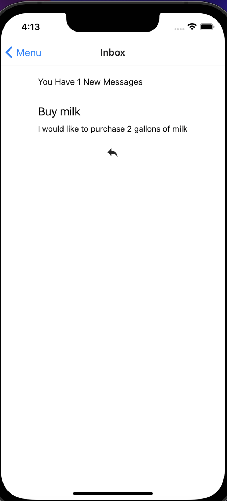

# FarmMart
FarmMart is a platform that allows the user to easily locate farms that sell produce on a map in order to provide them with an ease of choice on where to buy fresh produce. The purpose of this app is add farmers a new stream of revenue that cuts the middle-man which enables a higher profit margin as well as potentially lower price for the consumers.

Target Audience:

	The target audience for our application is catered towards everybody who wants to purchase cheaper and fresher produce than available at supermarkets.
Features:

	Create an account, add a store, lookup stores on a map, send messages to sellers, read messages sent to you, reply to messages.

Services/functionalities:

	Provides local businesses with the ability to grow, as well as receive more advertisement.
More traffic allows the fruit to not be wasted if they are not harvested.

